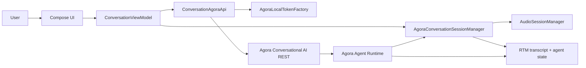
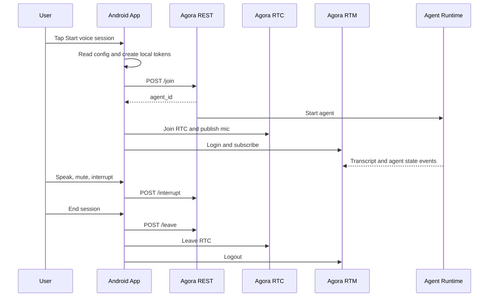
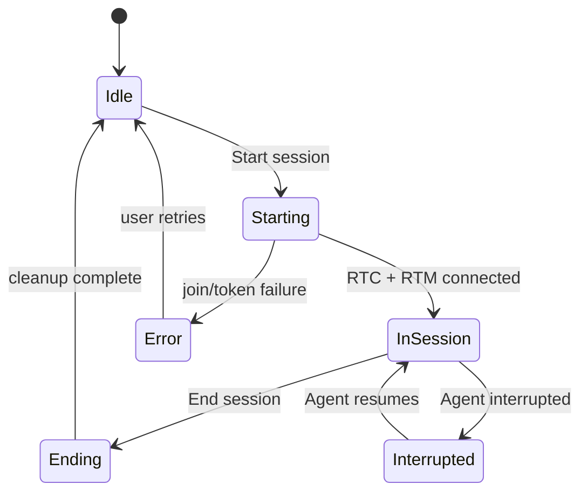
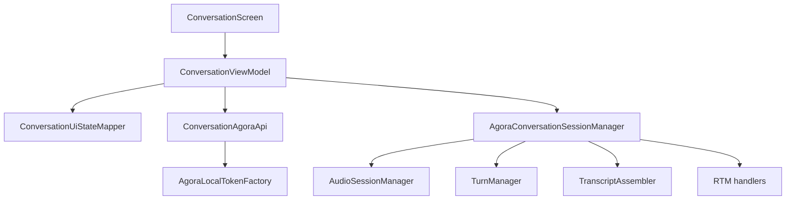
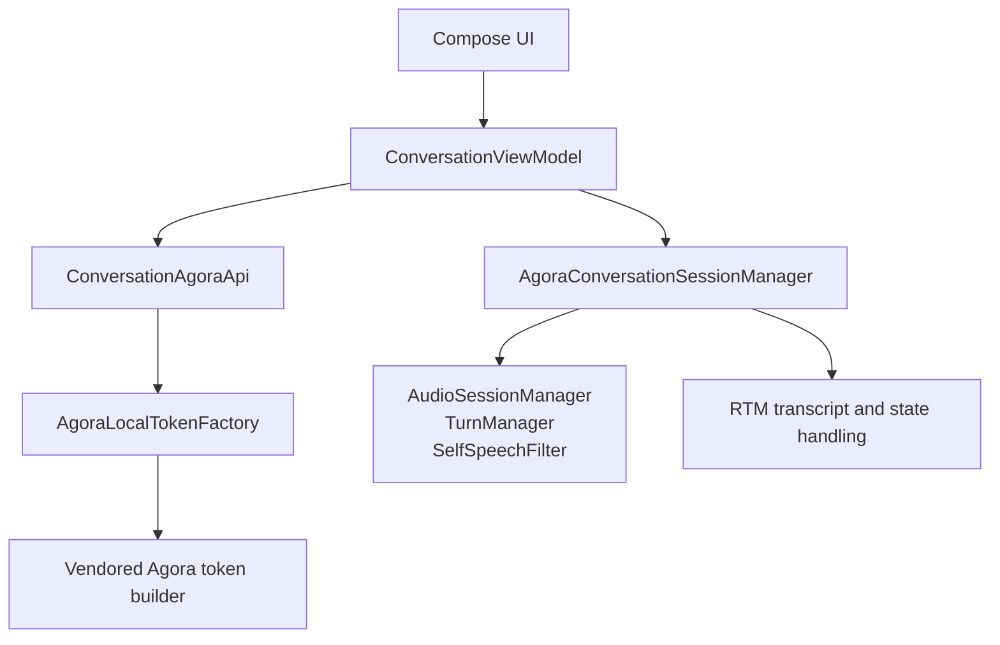
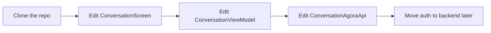
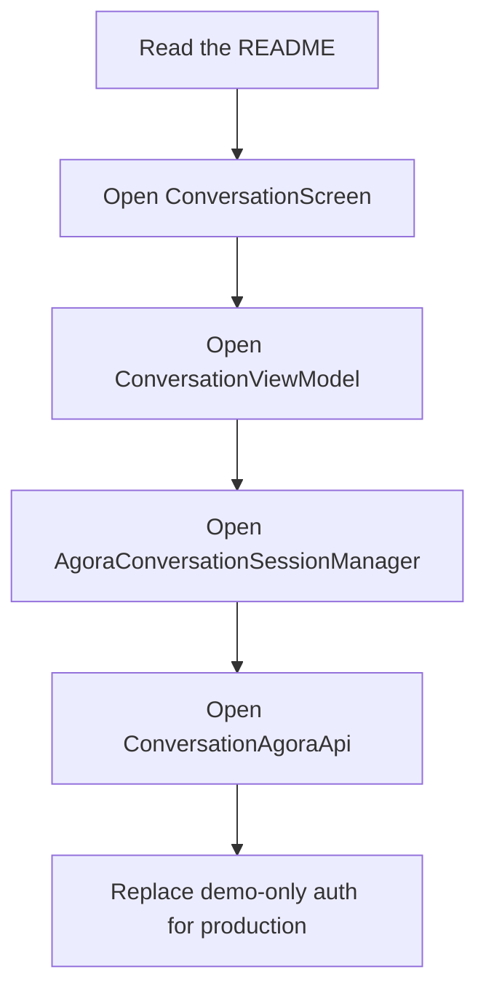

# Agora Conversational AI Android Quickstart

This repository is a **template-style Android starter** for building a Voice AI app with Agora Conversational AI.

It gives you a single Kotlin + Jetpack Compose app that:

- joins an Agora RTC channel
- starts an Agora Conversational AI agent
- listens for transcript and agent state updates
- lets the user talk, mute, and end the session
- keeps the whole demo in one Android project so it is easy to understand and customize

## Why Use Agora For Voice AI

Agora is a good fit when you want low-latency realtime voice with an AI agent because it gives you the media and session plumbing instead of forcing you to build it all yourself.

With Agora Conversational AI, you get:

- realtime RTC audio transport
- RTM-based agent state and transcript events
- agent lifecycle control through REST
- interruption and turn-taking support
- a clean path from prototype to production

That means your app can focus on product logic and UI, while Agora handles the realtime voice infrastructure and agent session behavior.

## What This Template Is

This repo is intentionally a **direct REST demo**.

It is useful when you want to:

- learn how Agora Conversational AI works end to end
- ship a quick prototype without a backend
- build a reusable Android template for your team
- understand the minimum code needed for a voice AI app

It is **not production-safe as-is** because the App Certificate is packaged into the Android app and used for local token generation.

For production:

- move token generation to your backend
- move REST `join`, `interrupt`, and `leave` calls to your backend
- keep the Android app as a thin UI client

## How It Works

1. The app reads `AGORA_APP_ID`, `AGORA_APP_CERTIFICATE`, and related config from `local.properties`.
2. It generates RTC, RTM, and agent REST tokens locally for demo convenience.
3. It calls Agora REST to start the Conversational AI agent.
4. The Android app joins the RTC channel and subscribes to RTM.
5. The agent sends transcripts and state updates back to the app.
6. The user can speak, mute, interrupt, and end the session from the UI.

## Architecture At A Glance



This is the core template shape:

- the UI owns user actions
- the ViewModel owns screen state
- the API owns REST calls
- the session manager owns RTC/RTM and audio behavior

## Session Lifecycle



## Session States



## Quick Start

### 1. Create an Agora project

Create or choose an Agora project with Conversational AI enabled.

You need:

- `App ID`
- `App Certificate`
- access to RTC and RTM for the project

### 2. Clone this repo

```bash
git clone <your-fork-or-repo-url>
cd agent-quickstart-android
```

### 3. Add your Agora config

Put the following values in `local.properties` at the repo root:

```properties
AGORA_APP_ID=your_agora_app_id
AGORA_APP_CERTIFICATE=your_agora_app_certificate
AGORA_AGENT_UID=123456
```

Optional values:

```properties
AGORA_CONVOAI_BASE_URL=https://api.agora.io/api/conversational-ai-agent/v2/projects
AGORA_AREA=US
```

### 4. Build the app

```bash
JAVA_HOME="/Applications/Android Studio.app/Contents/jbr/Contents/Home" ./gradlew :app:assembleDebug
```

### 5. Run it

Open the project in Android Studio, or run it from the command line, then launch it on a device or emulator.

### 6. Start a session

Tap **Start voice session**, allow microphone permission, speak to the agent, and watch transcripts appear in realtime.

### 7. End the session

Use the end-session control to stop the conversation cleanly.

## What A New User Should Read First

If you are using this as a template, the best starting files are:

- [ConversationScreen.kt](app/src/main/java/com/androidengineers/agent_quickstart_android/ui/ConversationScreen.kt)
- [ConversationViewModel.kt](app/src/main/java/com/androidengineers/agent_quickstart_android/ui/ConversationViewModel.kt)
- [AgoraConversationSessionManager.kt](app/src/main/java/com/androidengineers/agent_quickstart_android/rtc/AgoraConversationSessionManager.kt)
- [ConversationAgoraApi.kt](app/src/main/java/com/androidengineers/agent_quickstart_android/data/ConversationAgoraApi.kt)
- [AgoraLocalTokenFactory.kt](app/src/main/java/com/androidengineers/agent_quickstart_android/data/AgoraLocalTokenFactory.kt)

Those files show the full flow from UI action to Agora session setup.

## What To Customize First

Most teams will customize these pieces first:

1. `ConversationScreen.kt`
   - change the UI layout, branding, and session cards
2. `ConversationViewModel.kt`
   - change the app state, button actions, and session orchestration
3. `ConversationAgoraApi.kt`
   - change agent presets, base URL, geofence, or startup behavior
4. `AgoraLocalTokenFactory.kt`
   - replace with your own backend token flow when you are ready for production

## Repo Structure

### Android Client

- `app/src/main/java/com/androidengineers/agent_quickstart_android/MainActivity.kt`
  app entry point and microphone permission handling
- `app/src/main/java/com/androidengineers/agent_quickstart_android/ui/ConversationScreen.kt`
  Compose UI for the pre-session and active-session states
- `app/src/main/java/com/androidengineers/agent_quickstart_android/ui/ConversationViewModel.kt`
  screen state and user actions
- `app/src/main/java/com/androidengineers/agent_quickstart_android/ui/ConversationUiStateMapper.kt`
  pure mapping from session data to UI state
- `app/src/main/java/com/androidengineers/agent_quickstart_android/rtc/AgoraConversationSessionManager.kt`
  RTC, RTM, transcript, and audio session lifecycle
- `app/src/main/java/com/androidengineers/agent_quickstart_android/data/ConversationAgoraApi.kt`
  direct Agora REST client
- `app/src/main/java/com/androidengineers/agent_quickstart_android/data/AgoraLocalTokenFactory.kt`
  demo-only local token generation
- `app/src/main/java/com/androidengineers/agent_quickstart_android/config/QuickstartConfig.kt`
  configuration helpers
- `app/src/main/java/com/androidengineers/agent_quickstart_android/model/ConversationModels.kt`
  shared data models

## Code Map



This is the easiest way to understand where the code lives:

- the screen renders state
- the ViewModel coordinates actions
- the session manager owns realtime behavior
- the API talks to Agora REST
- the audio helpers handle the voice edge cases

### Voice Logic

- `app/src/main/java/com/androidengineers/agent_quickstart_android/audio/AudioSessionManager.kt`
- `app/src/main/java/com/androidengineers/agent_quickstart_android/audio/TurnManager.kt`
- `app/src/main/java/com/androidengineers/agent_quickstart_android/audio/SelfSpeechFilter.kt`
- `app/src/main/java/com/androidengineers/agent_quickstart_android/audio/BargeInDetector.kt`
- `app/src/main/java/com/androidengineers/agent_quickstart_android/rtc/TranscriptAssembler.kt`

### Tests

- `app/src/test/java/com/androidengineers/agent_quickstart_android/TranscriptAssemblerTest.kt`
- `app/src/test/java/com/androidengineers/agent_quickstart_android/audio/TurnManagerTest.kt`
- `app/src/test/java/com/androidengineers/agent_quickstart_android/audio/SelfSpeechFilterTest.kt`
- `app/src/test/java/com/androidengineers/agent_quickstart_android/ui/ConversationUiStateMapperTest.kt`

## Architecture



The app keeps the template simple by using one Android client, one direct Agora REST client, and one session manager that owns the realtime media lifecycle.

## Why This Template Is Useful

This repository is meant to help you move fast without having to invent the Agora wiring from scratch.

It shows how to:

- set up a realtime voice app in Android
- coordinate RTC, RTM, and agent REST calls
- display transcript and agent state in Compose
- keep the app structure understandable for future contributors
- use Agora as the realtime backbone for a voice AI experience

## What To Edit First



If you are building a product around a voice assistant, this gives you a practical starting point for:

- support assistants
- call-center copilots
- interactive voice demos
- realtime conversational agents
- internal voice workflows and prototypes

## Default Agent Setup

The demo starts the agent with:

- `deepgram_nova_3`
- `openai_gpt_4o_mini`
- `minimax_speech_2_6_turbo`

It also enables:

- RTM event delivery
- RTM data channel transcripts
- start-of-speech interruption
- VAD-based end-of-speech detection

## Required Configuration

Required in `local.properties`:

- `AGORA_APP_ID`
- `AGORA_APP_CERTIFICATE`

Optional in `local.properties`:

- `AGORA_AGENT_UID`
  defaults to `123456`
- `AGORA_CONVOAI_BASE_URL`
  defaults to `https://api.agora.io/api/conversational-ai-agent/v2/projects`
- `AGORA_AREA`
  defaults to `US`

Notes:

- `AGORA_APP_ID` also supports the legacy key `agora.app.id`
- `AGORA_AREA` maps to the ConvoAI REST `geofence.area` value

## Build And Test

Compile Kotlin:

```bash
JAVA_HOME="/Applications/Android Studio.app/Contents/jbr/Contents/Home" ./gradlew :app:compileDebugKotlin
```

Run unit tests:

```bash
JAVA_HOME="/Applications/Android Studio.app/Contents/jbr/Contents/Home" ./gradlew :app:testDebugUnitTest
```

Assemble debug APK:

```bash
JAVA_HOME="/Applications/Android Studio.app/Contents/jbr/Contents/Home" ./gradlew :app:assembleDebug
```

## Troubleshooting

### App says configuration is missing

Check `local.properties` for:

- `AGORA_APP_ID`
- `AGORA_APP_CERTIFICATE`

### Agent start fails

Check:

- Conversational AI is enabled on the Agora project
- `AGORA_APP_ID` and `AGORA_APP_CERTIFICATE` belong to the same project
- the project supports RTC and RTM
- the App Certificate value is complete and correct

### RTM login or transcript flow fails

Check:

- the token was generated for the same RTM user ID the app logs in with
- the channel name is the same for REST, RTC, and RTM
- the project has RTM available

### Microphone does not start

Check:

- Android microphone permission is granted
- the device is not blocking mic access at the system level
- the app joined the RTC channel successfully

## Template Checklist

If you fork this repo for your own team or template, the minimum setup is:

1. Create an Agora project with Conversational AI enabled.
2. Put `AGORA_APP_ID` and `AGORA_APP_CERTIFICATE` into `local.properties`.
3. Build and run the Android app.
4. Customize the UI and session text.
5. Move token generation and REST calls to a backend before shipping publicly.

## Suggested Learning Path



If you are new to Agora, this is the best order:

1. See the UI first.
2. Learn how the ViewModel wires actions.
3. Inspect how the session manager handles RTC, RTM, and audio.
4. Read the API layer that starts and stops the agent.
5. Replace demo-only pieces once the end-to-end flow is clear.

## Security Note

This branch is intentionally convenient, not secure.

Because `AGORA_APP_CERTIFICATE` is packaged into the app, anyone with the built APK can extract it and use your Agora project.

For any shared, published, or production app:

- move token generation to your backend
- move REST `join`, `interrupt`, and `leave` calls to your backend
- never ship the App Certificate inside the app
