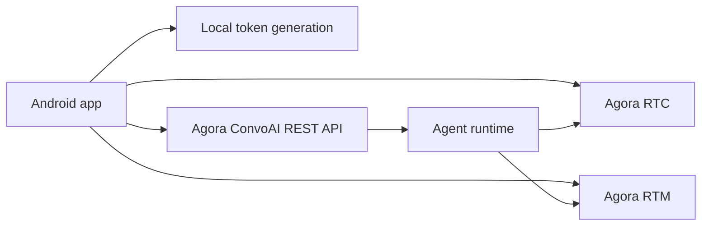
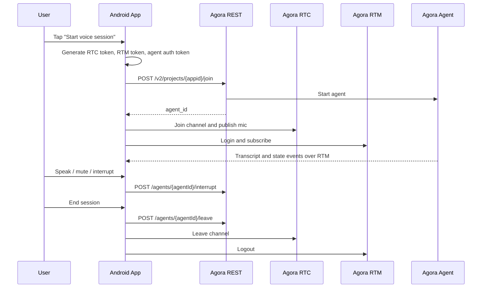
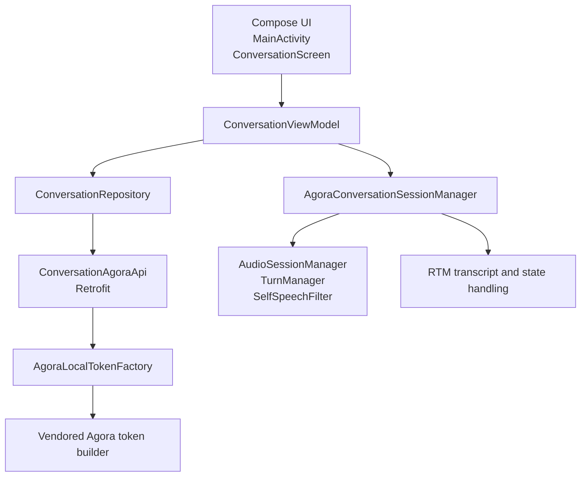

# Agora Conversational AI Android Quickstart (Direct REST Demo)

Android quickstart for trying Agora Conversational AI directly from a Kotlin app using:

- Kotlin
- Jetpack Compose
- Coroutines
- Agora RTC
- Agora RTM
- Retrofit
- Agora Conversational AI REST API

This `rest-api` branch does **not** require a local server.

## Important

This branch is intentionally a **demo-only direct mode**.

The app reads `AGORA_APP_CERTIFICATE` from `local.properties`, generates tokens on device, and calls Agora REST directly from Android. That is convenient for a quickstart, but it is **not production-safe** because the App Certificate is packaged into the app.

Use this branch to learn the flow quickly. For production, move token generation and REST calls to your own backend.

## What This Demo Does

- generates RTC, RTM, and ConvoAI auth tokens locally in the app
- calls Agora REST `join`, `interrupt`, and `leave` directly with Retrofit
- joins the RTC channel from Android
- logs into RTM for transcript and agent-state events
- renders the voice session with a Compose UI

No third-party LLM, STT, or TTS keys are required for the default path because this sample uses Agora-managed presets.

## Run It

1. Create or choose an Agora project with Conversational AI enabled.
2. Get your `App ID` and `App Certificate`.
3. Clone this repo.
4. Put your credentials in `local.properties`.
5. Run the app from Android Studio or Gradle.

```bash
git clone <your-fork-or-repo-url>
cd agent-quickstart-android
```

Add these values to `local.properties` in the repo root:

```properties
AGORA_APP_ID=your_agora_app_id
AGORA_APP_CERTIFICATE=your_agora_app_certificate
AGORA_AGENT_UID=123456
```

Optional:

```properties
AGORA_CONVOAI_BASE_URL=https://api.agora.io/api/conversational-ai-agent/v2/projects
AGORA_AREA=US
```

Build the app:

```bash
JAVA_HOME="/Applications/Android Studio.app/Contents/jbr/Contents/Home" ./gradlew :app:assembleDebug
```

Then open the project in Android Studio and run it on a device or emulator.

## Requirements

- Android Studio with a working Android SDK
- Java 11 compatible runtime
- An Agora project with:
  - Conversational AI enabled
  - a valid `App ID`
  - a valid `App Certificate`

## Required Configuration

Required in `local.properties`:

- `AGORA_APP_ID`
- `AGORA_APP_CERTIFICATE`

Optional in `local.properties`:

- `AGORA_AGENT_UID`
  defaults to `123456`
- `AGORA_CONVOAI_BASE_URL`
  defaults to `https://api.agora.io/api/conversational-ai-agent/v2/projects`
- `AGORA_AREA`
  defaults to `US`

Notes:

- `AGORA_APP_ID` also supports the legacy key `agora.app.id`
- `AGORA_AREA` maps to the ConvoAI REST `geofence.area` value
- this branch does not need `AGORA_BACKEND_BASE_URL`

## Architecture



The app generates user and agent tokens locally, starts the agent through Agora REST, and then uses RTC and RTM for realtime media and events.

## Session Flow



## Default Agent Setup

The app starts the agent with the preset:

- `deepgram_nova_3`
- `openai_gpt_4o_mini`
- `minimax_speech_2_6_turbo`

It also enables:

- RTM event delivery
- RTM data channel transcripts
- start-of-speech interruption
- VAD-based end-of-speech detection

## Android App Layers



## Repo Map

### Android Client

- `app/src/main/java/com/androidengineers/agent_quickstart_android/MainActivity.kt`
  app entry point and permission handling
- `app/src/main/java/com/androidengineers/agent_quickstart_android/ui/ConversationScreen.kt`
  Compose UI for pre-session and connected session
- `app/src/main/java/com/androidengineers/agent_quickstart_android/ui/ConversationViewModel.kt`
  screen state orchestration
- `app/src/main/java/com/androidengineers/agent_quickstart_android/rtc/AgoraConversationSessionManager.kt`
  RTC and RTM lifecycle plus transcript/state handling
- `app/src/main/java/com/androidengineers/agent_quickstart_android/data/ConversationRepository.kt`
  app-facing session use cases
- `app/src/main/java/com/androidengineers/agent_quickstart_android/data/ConversationAgoraApi.kt`
  direct Agora REST client using Retrofit
- `app/src/main/java/com/androidengineers/agent_quickstart_android/data/AgoraLocalTokenFactory.kt`
  on-device token generation for this demo branch
- `app/src/main/java/com/androidengineers/agent_quickstart_android/config/QuickstartConfig.kt`
  `BuildConfig` and local configuration access
- `app/src/main/java/io/agora/media/`
  vendored official Agora Java token-builder source adapted for Android

### Tests

- `app/src/test/java/com/androidengineers/agent_quickstart_android/TranscriptAssemblerTest.kt`
- `app/src/test/java/com/androidengineers/agent_quickstart_android/audio/TurnManagerTest.kt`
- `app/src/test/java/com/androidengineers/agent_quickstart_android/audio/SelfSpeechFilterTest.kt`

## Direct REST Contract Used by the App

The app calls these Agora endpoints directly:

- `POST /v2/projects/{appid}/join`
- `POST /v2/projects/{appid}/agents/{agentId}/interrupt`
- `POST /v2/projects/{appid}/agents/{agentId}/leave`

The default base URL is:

```text
https://api.agora.io/api/conversational-ai-agent/v2/projects
```

## Build Commands

Compile Kotlin:

```bash
JAVA_HOME="/Applications/Android Studio.app/Contents/jbr/Contents/Home" ./gradlew :app:compileDebugKotlin
```

Assemble debug APK:

```bash
JAVA_HOME="/Applications/Android Studio.app/Contents/jbr/Contents/Home" ./gradlew :app:assembleDebug
```

Run unit tests:

```bash
JAVA_HOME="/Applications/Android Studio.app/Contents/jbr/Contents/Home" ./gradlew :app:testDebugUnitTest
```

## Troubleshooting

### App says configuration is missing

Check `local.properties` for:

- `AGORA_APP_ID`
- `AGORA_APP_CERTIFICATE`

### Agent start fails

Check:

- Conversational AI is enabled on the Agora project
- `AGORA_APP_ID` and `AGORA_APP_CERTIFICATE` belong to the same project
- the project supports RTC and RTM
- the App Certificate value is complete and correct

### RTM login or transcript flow fails

Check:

- the token was generated for the same RTM user ID the app logs in with
- the channel name is the same for REST, RTC, and RTM
- the project has RTM available

### Microphone does not start

Check:

- Android microphone permission is granted
- the device is not blocking mic access at the system level
- the app joined the RTC channel successfully

## Reference

This Android demo follows the same high-level quickstart shape as the official Next.js sample:

- `AgoraIO-Conversational-AI/agent-quickstart-nextjs`

This branch adapts that flow into a single Android app that:

- uses Kotlin and Compose
- generates tokens locally for demo convenience
- calls Agora REST directly with Retrofit

## Security Note

This branch is intentionally convenient, not secure.

Because `AGORA_APP_CERTIFICATE` is packaged into the app, anyone with the built APK can extract it and use your Agora project.

For any shared, published, or production app:

- move token generation to your backend
- move REST `join`, `interrupt`, and `leave` calls to your backend
- never ship the App Certificate inside the app
