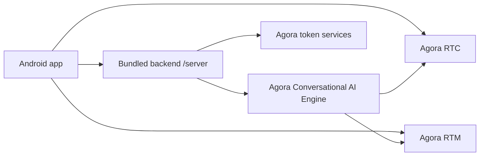
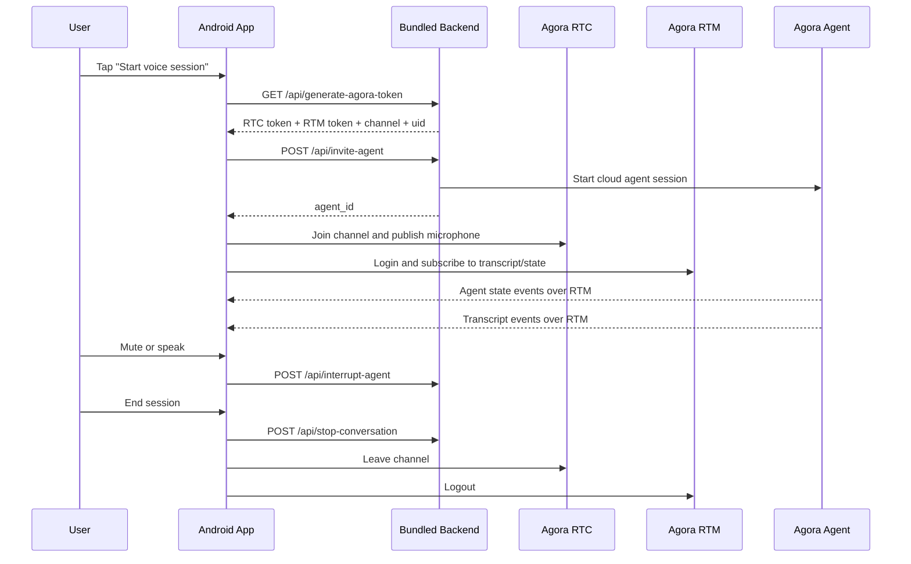
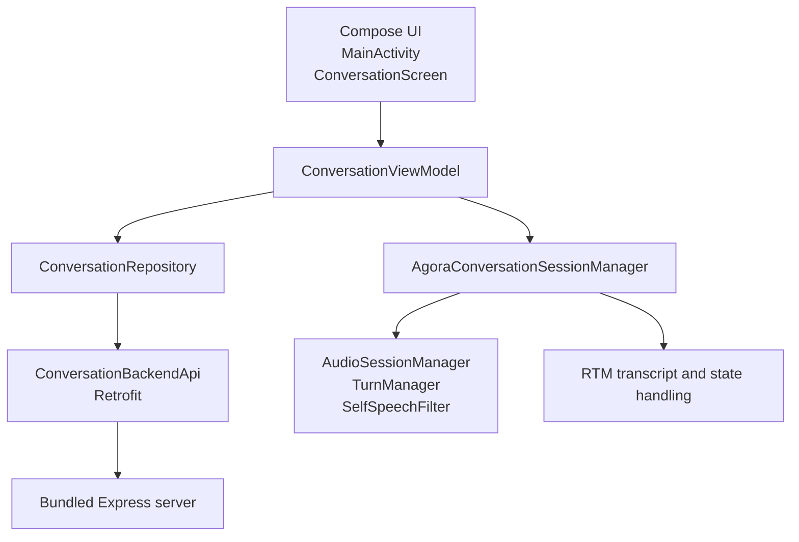
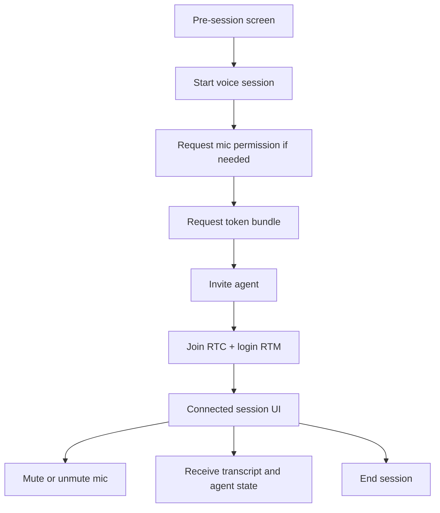

# Agora Conversational AI Android Quickstart

Official Android quickstart for building a realtime voice AI experience with Agora Conversational AI Engine.

This repository is intentionally self-contained:

- the Android client lives in `app/`
- the lightweight backend lives in `server/`

You do not need the separate Next.js quickstart to run the mobile experience.

## Run It

1. Create a project in [Agora Console](https://console.agora.io/) and copy your `App ID` and `App Certificate`.
2. Clone this repo.
3. Configure the bundled backend.
4. Configure the Android app.
5. Start the backend.
6. Run the Android app on an emulator or device.

```bash
git clone <your-fork-or-repo-url>
cd agent-quickstart-android
```

Configure the backend:

```bash
cd server
cp .env.example .env
```

Set these values in `server/.env`:

```properties
AGORA_APP_ID=your_agora_app_id
AGORA_APP_CERTIFICATE=your_agora_app_certificate
AGORA_AGENT_UID=123456
```

Then configure `local.properties` in the repo root:

```properties
AGORA_APP_ID=your_agora_app_id
AGORA_BACKEND_BASE_URL=http://10.0.2.2:3000
AGORA_AGENT_UID=123456
```

Start the backend:

```bash
cd server
npm install
npm run dev
```

Run the Android app:

```bash
cd agent-quickstart-android
JAVA_HOME="/Applications/Android Studio.app/Contents/jbr/Contents/Home" ./gradlew :app:assembleDebug
```

Open the project in Android Studio or install the generated debug APK on your emulator or device.

## Requirements

- Android Studio with a working Android SDK
- Java 11 compatible runtime
- Node.js `22+`
- An Agora project with a valid `App ID` and `App Certificate`

## Required Configuration

Backend required variables:

- `AGORA_APP_ID`
- `AGORA_APP_CERTIFICATE`

Backend optional variables:

- `AGORA_AGENT_UID`
  defaults to `123456`
- `AGORA_SERVER_PORT`
  defaults to `3000`
- `AGORA_AREA`
  defaults to `US`
- `AGORA_AGENT_GREETING`
  overrides the spoken greeting

Android app required values:

- `AGORA_APP_ID`
- `AGORA_BACKEND_BASE_URL`

Android app optional values:

- `AGORA_AGENT_UID`
  defaults to `123456`

Notes:

- `AGORA_AGENT_UID` should match in both `server/.env` and `local.properties`
- for the Android emulator, `http://10.0.2.2:3000` maps to your Mac's localhost
- for a physical device, replace `AGORA_BACKEND_BASE_URL` with your machine's LAN IP, for example `http://192.168.1.10:3000`
- the app also accepts the legacy `agora.app.id` key from `local.properties`, but `AGORA_APP_ID` is the recommended key

## Architecture



The Android client uses the backend for token generation and agent lifecycle operations, then talks to Agora Cloud for realtime audio, transcript events, and agent state updates.

## Session Flow



## What You Get

- Android app built with Kotlin, Jetpack Compose, and coroutines
- Material 3 pre-session and live-session UI
- Agora RTC audio integration
- Agora RTM transcript and agent-state integration
- bundled Node.js backend for token generation and agent lifecycle control
- Retrofit-based backend client
- local transcript assembly and turn-management tests

## How It Works

1. The app requests an RTC + RTM token bundle from `GET /api/generate-agora-token`.
2. The backend starts the cloud agent with `POST /api/invite-agent`.
3. The Android client joins the RTC channel and publishes microphone audio.
4. The app logs into RTM and receives transcript and agent-state events.
5. User speech, barge-in handling, and session state are reflected in the Compose UI.
6. The app can interrupt the active agent turn with `POST /api/interrupt-agent`.
7. The session is ended with `POST /api/stop-conversation`.

## Android App Layers



## Repo Map

### Top-Level

- `app/`
  Android client
- `server/`
  local Express backend for tokens and agent lifecycle

### Android Client

- `app/src/main/java/com/androidengineers/agent_quickstart_android/MainActivity.kt`
  entry point, permission handling, Compose host
- `app/src/main/java/com/androidengineers/agent_quickstart_android/ui/ConversationScreen.kt`
  pre-session and connected session UI
- `app/src/main/java/com/androidengineers/agent_quickstart_android/ui/ConversationViewModel.kt`
  screen state orchestration
- `app/src/main/java/com/androidengineers/agent_quickstart_android/data/ConversationRepository.kt`
  backend use-cases
- `app/src/main/java/com/androidengineers/agent_quickstart_android/data/ConversationBackendApi.kt`
  Retrofit backend client
- `app/src/main/java/com/androidengineers/agent_quickstart_android/rtc/AgoraConversationSessionManager.kt`
  RTC/RTM session lifecycle, transcript and state handling
- `app/src/main/java/com/androidengineers/agent_quickstart_android/rtc/TranscriptAssembler.kt`
  transcript message assembly
- `app/src/main/java/com/androidengineers/agent_quickstart_android/audio/`
  turn state, self-speech filtering, playback, and audio-session helpers
- `app/src/main/java/com/androidengineers/agent_quickstart_android/config/QuickstartConfig.kt`
  BuildConfig-backed local configuration

### Backend

- `server/src/index.mjs`
  Express server, Agora token generation, agent start, interrupt, and stop routes
- `server/.env.example`
  backend environment template
- `server/package.json`
  backend scripts and dependencies

### Tests

- `app/src/test/java/com/androidengineers/agent_quickstart_android/TranscriptAssemblerTest.kt`
- `app/src/test/java/com/androidengineers/agent_quickstart_android/audio/TurnManagerTest.kt`
- `app/src/test/java/com/androidengineers/agent_quickstart_android/audio/SelfSpeechFilterTest.kt`

## Backend API Contract

The bundled backend exposes:

- `GET /`
  simple route listing
- `GET /health`
  health check
- `GET /api/generate-agora-token`
  returns RTC token, RTM token, channel, uid, and RTM user id
- `POST /api/invite-agent`
  starts the cloud agent session
- `POST /api/interrupt-agent`
  interrupts the active agent turn
- `POST /api/stop-conversation`
  stops the active cloud agent session

Sample health check:

```bash
curl -i http://localhost:3000/health
```

## UI Flow



## Local Development Notes

- `usesCleartextTraffic` is enabled for local development so the Android app can call `http://10.0.2.2:3000`
- the `App Certificate` stays on the backend and never ships inside the APK
- the Android app keeps the `App ID` locally through `BuildConfig`
- the bundled server is intentionally lightweight and optimized for quickstart usage, not production hardening

## Base Agent Configuration

The bundled server defines an opinionated default agent in `server/src/index.mjs`:

- Agora-managed conversational agent session
- Deepgram STT
- OpenAI LLM
- MiniMax TTS
- RTM enabled for transcript and state delivery

The goal is to make the default quickstart runnable without requiring additional vendor API keys for the base path.

## Android Build Commands

Compile Kotlin:

```bash
JAVA_HOME="/Applications/Android Studio.app/Contents/jbr/Contents/Home" ./gradlew :app:compileDebugKotlin
```

Assemble debug APK:

```bash
JAVA_HOME="/Applications/Android Studio.app/Contents/jbr/Contents/Home" ./gradlew :app:assembleDebug
```

Run unit tests:

```bash
JAVA_HOME="/Applications/Android Studio.app/Contents/jbr/Contents/Home" ./gradlew :app:testDebugUnitTest
```

Check backend syntax:

```bash
cd server
node --check src/index.mjs
```

## Troubleshooting

### App says configuration is missing

Check:

- `AGORA_APP_ID` in `local.properties`
- `AGORA_BACKEND_BASE_URL` in `local.properties`
- `AGORA_APP_ID` and `AGORA_APP_CERTIFICATE` in `server/.env`

### Emulator cannot reach the backend

Use:

```properties
AGORA_BACKEND_BASE_URL=http://10.0.2.2:3000
```

Do not use `http://localhost:3000` from the emulator.

### Physical device cannot reach the backend

Use your Mac's LAN IP instead of `10.0.2.2`, for example:

```properties
AGORA_BACKEND_BASE_URL=http://192.168.1.10:3000
```

Make sure the phone and your machine are on the same network.

### Agent starts but does not join correctly

Check:

- the backend server is running
- `AGORA_AGENT_UID` matches in both the server and Android app
- `GET /health` returns `200 OK`
- Agora credentials belong to the same project

### Microphone does not start

Check:

- Android microphone permission is granted
- the device is not blocking the mic at the system level
- the app has joined the RTC channel successfully

## Reference

This Android repository follows the same quickstart shape as the official Next.js sample:

- `AgoraIO-Conversational-AI/agent-quickstart-nextjs`

The Android version adapts that flow for:

- Kotlin
- Jetpack Compose
- coroutines
- Android microphone permissions
- emulator and physical-device networking

## License and Usage

Use this repository as a developer sample and starting point for your own Agora Conversational AI Android integrations. Before shipping to production, move the backend to a hardened deployment, remove local cleartext assumptions, and apply your own monitoring, auth, and secrets management.
