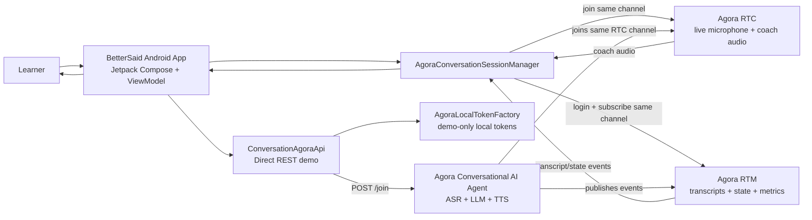
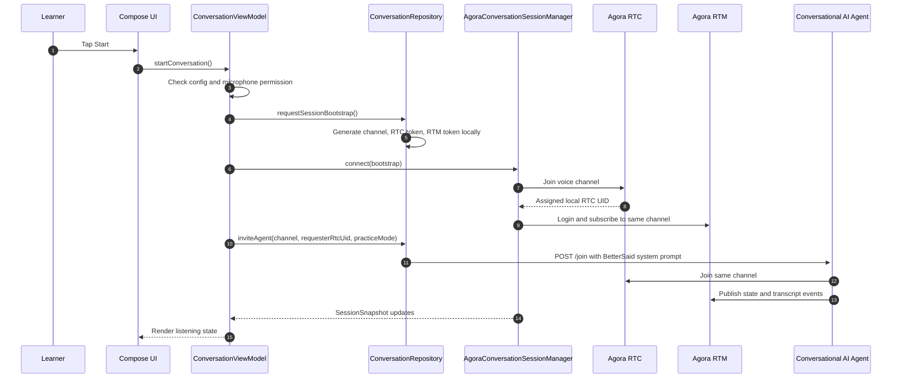
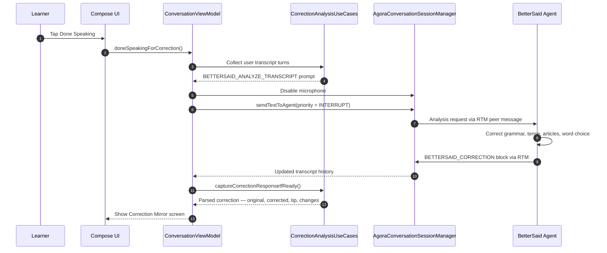
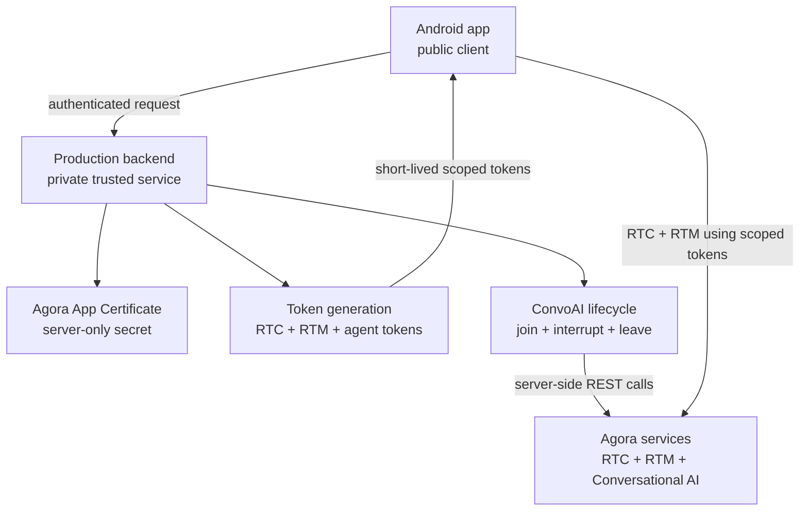

# BetterSaid — AI English Coach for Android


> Speak freely, tap **Done Speaking**, and a real-time AI coach returns a corrected sentence, a plain-language tip, and the exact words that changed — highlighted in place.

BetterSaid is a **full working demo** of [Agora Conversational AI](https://docs.agora.io/en/conversational-ai) on Android. It shows how to wire up live voice (RTC), real-time transcripts (RTM), and an LLM-backed coaching agent with a structured correction protocol — all from a single Android app, no backend required for development.

---

## Why This Demo is Worth Exploring

Most voice-AI demos on Android stop at "mic → LLM → speaker." BetterSaid goes further:

| What it does | Why it is interesting |
|---|---|
| **Structured agent output** | The agent embeds a `BETTERSAID_CORRECTION` block in its response. The app parses it into original/corrected/tip/changes and renders word-level highlights using an LCS diff — no server-side parsing step. |
| **Controlled correction flow** | The agent never interrupts normal speech. Correction only runs when the app sends an explicit `BETTERSAID_ANALYZE_TRANSCRIPT` interrupt over RTM. |
| **Barge-in with dedup** | The user can interrupt the agent mid-speech. The interrupt REST call is deduplicated by turn ID and rate-limited to prevent hammering the API. |
| **Race-condition-free session state** | `inConversation` is entirely ViewModel-owned, never derived from RTC/RTM snapshot fields. The end-call sequence writes the fresh state before disconnect so no `collectLatest` race can reinstate the conversation screen. |
| **Local token demo, production boundary documented** | Tokens are generated on-device for zero-friction setup. The README shows exactly what moves to your backend before you ship publicly. |

---

## What You Will Build

```
┌─────────────────────────────────────────────────────┐
│  Home Screen                                        │
│  ┌──────────┐ ┌──────────┐ ┌──────────┐            │
│  │Daily Life│ │Interview │ │  Travel  │  ← modes   │
│  └──────────┘ └──────────┘ └──────────┘            │
│  [ Start Practicing ]                               │
└─────────────────────────────────────────────────────┘
           ↓  tap Start
┌─────────────────────────────────────────────────────┐
│  Listening Screen          🎙  agent is live        │
│                                                     │
│       ≋≋≋≋≋  wave visualizer  ≋≋≋≋≋               │
│                                                     │
│  "I had gone school tomorrow."                      │
│                                                     │
│  [ Done Speaking ]    [ End Call ]                  │
└─────────────────────────────────────────────────────┘
           ↓  correction arrives
┌─────────────────────────────────────────────────────┐
│  Correction                                         │
│                                                     │
│  Original   I had gone school tomorrow.             │
│  Corrected  I will go to school tomorrow.           │
│                                                     │
│  ✦ had gone → will go                              │
│  ✦ school → to school                              │
│                                                     │
│  Tip  Use "will" for future plans and include "to"  │
│       before "school."                              │
│                                                     │
│  [ Ask the Coach ]    [ End Call ]                  │
└─────────────────────────────────────────────────────┘
```

---

## Tech Stack

| Layer | Technology |
|---|---|
| Language | Kotlin 2.2 |
| UI | Jetpack Compose (Material 3, BOM 2026.02) |
| Architecture | MVVM — `ConversationViewModel` + `StateFlow` |
| Voice channel | Agora RTC SDK 4.3.2 |
| Transcript & state | Agora RTM SDK 2.2.4 |
| AI agent lifecycle | Agora Conversational AI REST API v2 |
| ASR | Deepgram Nova 3 |
| LLM | OpenAI GPT-4o mini |
| TTS | Murf Falcon |
| HTTP | Retrofit 2 + OkHttp |
| Memory leak detection | LeakCanary (debug builds) |

---

## Features

| Feature | Detail |
|---|---|
| **4 Practice Modes** | Daily Life, Interview, Travel, School — each tunes the coach's focus and example set |
| **Done Speaking** | One tap sends the full transcript to the coach for correction analysis |
| **Correction Mirror** | Original sentence, corrected sentence, and word-level highlights (LCS diff) |
| **Tip & Changes** | Short human-readable tip + `from → to` word-pair list |
| **Ask the Coach** | Re-enable mic and ask follow-up questions in the same session |
| **Auto-mute on coach** | Microphone mutes while the coach speaks; re-opens when the coach finishes |
| **Barge-in** | Tap the wave card to interrupt the coach mid-sentence |
| **Token renewal** | RTC token is renewed in-flight via `onTokenPrivilegeWillExpire` — long sessions stay live |
| **Light & dark themes** | Warm Digital Paper aesthetic in both light and dark variants |

### Practice Modes

| Mode | Coach Focus |
|---|---|
| **Daily Life** | Casual conversation, errands, friends, food, routines, small talk |
| **Interview** | Clear professional answers, confident phrasing, polite workplace English |
| **Travel** | Airports, hotels, directions, restaurants, transport, asking for help |
| **School** | Classroom English, explaining ideas, asking academic questions |

---

## Quickstart (5 minutes)

### 1. Prerequisites

- Android Studio Ladybug or later (JDK 17+)
- Agora account with a project that has **Conversational AI**, **RTC**, and **RTM** enabled
- Android device or emulator — API 26+, microphone required

### 2. Add your credentials

Create `local.properties` in the repo root (it is already in `.gitignore`):

```properties
AGORA_APP_ID=your_agora_app_id
AGORA_APP_CERTIFICATE=your_agora_app_certificate
MURF_API_KEY=your_murf_api_key
```

Optionally override defaults:

```properties
AGORA_AGENT_UID=123456
AGORA_CONVOAI_BASE_URL=https://api.agora.io/api/conversational-ai-agent/v2/projects
AGORA_AREA=US
MURF_VOICE_ID=Anisha
MURF_LOCALE=en-IN
MURF_MODEL=FALCON
MURF_BASE_URL=wss://in.api.murf.ai/v1/speech/stream-input
AGORA_ASR_VENDOR=sarvam
AGORA_ASR_LANGUAGE=unknown
SARVAM_API_KEY=your_sarvam_api_key
```

> **Where to find these:** Agora Console → your project → App ID and App Certificate. Make sure Conversational AI is enabled for the project. Use the Murf API dashboard for `MURF_API_KEY`. For Hindi/Hinglish demos, use Sarvam ASR with `AGORA_ASR_VENDOR=sarvam`, `AGORA_ASR_LANGUAGE=unknown`, and `SARVAM_API_KEY`.

### 3. Run

Open the project in Android Studio and press **Run**, or from the terminal:

```bash
./gradlew :app:assembleDebug
```

```bash
./gradlew :app:installDebug
```

> **macOS tip:** If Gradle cannot find a JDK, prefix with `JAVA_HOME="/Applications/Android Studio.app/Contents/jbr/Contents/Home"`.

### 4. Test

```bash
./gradlew :app:testDebugUnitTest
```

### Optional: Agora CLI setup

If you use the Agora CLI it can write credentials automatically:

```bash
curl -fsSL https://dl.agora.io/cli/install.sh | sh
agora login
agora quickstart env write . --template android --project <your-project>
agora project doctor --deep
```

---

## App Flow

```
1. Choose a practice mode on the home screen
2. Tap Start → allow microphone access → coach joins the channel
3. Speak freely in English — the coach listens without interrupting normal pauses
4. Tap Done Speaking when you want feedback
5. The coach returns:
      ORIGINAL:   what you said
      CORRECTED:  what sounds more natural
      TIP:        a short friendly grammar or usage note
      CHANGES:    word → word pairs for the most important edits
6. Read the correction, review highlighted word changes
7. Tap Ask the Coach for follow-up questions, or tap End Call to finish
```

---

## Architecture

No backend server is needed for development. The entire session runs peer-to-peer through Agora:

1. Android reads credentials from `local.properties` / `BuildConfig`.
2. The app generates short-lived demo tokens locally (RTC + RTM + agent REST).
3. `ConversationViewModel` requests a bootstrap channel and connects RTC + RTM.
4. The REST client invites a Conversational AI agent with the selected practice mode prompt.
5. RTM events stream transcripts, agent state, and correction output back to the app.
6. `ConversationUiStateMapper` maps live session snapshots into home / listening / correction UI state.

### Session State Machine

```
Home
  ↓  Tap Start
Starting
  ↓  RTC + RTM connected, agent joined
Listening   ←──────────────────────────┐
  ↓  Tap Done Speaking                 │  Tap Ask the Coach
Analyzing                              │
  ↓  Correction received               │
CorrectionDetails ─────────────────────┘
  ↓  Tap End Call (from any state)
Home
```

---

## Architecture Diagrams

### Voice Architecture


```mermaid
flowchart LR
    Learner["Learner"]
    Android["BetterSaid Android App\nJetpack Compose + ViewModel"]
    Session["AgoraConversationSessionManager"]
    Api["ConversationAgoraApi\nDirect REST demo"]
    Tokens["AgoraLocalTokenFactory\ndemo-only local tokens"]
    RTC["Agora RTC\nlive microphone + coach audio"]
    RTM["Agora RTM\ntranscripts + state + metrics"]
    ConvoAI["Agora Conversational AI Agent\nASR + LLM + TTS"]

    Learner --> Android
    Android --> Session
    Android --> Api
    Api --> Tokens
    Api -->|"POST /join"| ConvoAI
    Session -->|"join same channel"| RTC
    Session -->|"login + subscribe same channel"| RTM
    ConvoAI -->|"joins same RTC channel"| RTC
    ConvoAI -->|"publishes events"| RTM
    RTC -->|"coach audio"| Session
    RTM -->|"transcript/state events"| Session
    Session --> Android
    Android --> Learner
```

### Session Start Sequence


```mermaid
sequenceDiagram
    autonumber
    participant User as Learner
    participant UI as Compose UI
    participant VM as ConversationViewModel
    participant Repo as ConversationRepository
    participant Session as AgoraConversationSessionManager
    participant RTC as Agora RTC
    participant RTM as Agora RTM
    participant Agent as Conversational AI Agent

    User->>UI: Tap Start
    UI->>VM: startConversation()
    VM->>VM: Check config and microphone permission
    VM->>Repo: requestSessionBootstrap()
    Repo->>Repo: Generate channel, RTC token, RTM token locally
    VM->>Session: connect(bootstrap)
    Session->>RTC: Join voice channel
    RTC-->>Session: Assigned local RTC UID
    Session->>RTM: Login and subscribe to same channel
    VM->>Repo: inviteAgent(channel, requesterRtcUid, practiceMode)
    Repo->>+Agent: POST /join with BetterSaid system prompt
    Agent->>RTC: Join same channel
    Agent->>RTM: Publish state and transcript events
    Session-->>VM: SessionSnapshot updates
    VM-->>UI: Render listening state
```

### Correction Request Flow


```mermaid
sequenceDiagram
    autonumber
    participant User as Learner
    participant UI as Compose UI
    participant VM as ConversationViewModel
    participant Analysis as CorrectionAnalysisUseCases
    participant Session as AgoraConversationSessionManager
    participant Agent as BetterSaid Agent

    User->>UI: Tap Done Speaking
    UI->>VM: doneSpeakingForCorrection()
    VM->>Analysis: Collect user transcript turns
    Analysis-->>VM: BETTERSAID_ANALYZE_TRANSCRIPT prompt
    VM->>Session: Disable microphone
    VM->>Session: sendTextToAgent(priority = INTERRUPT)
    Session->>Agent: Analysis request via RTM peer message
    Agent->>Agent: Correct grammar, tense, articles, word choice
    Agent->>Session: BETTERSAID_CORRECTION block via RTM
    Session-->>VM: Updated transcript history
    VM->>Analysis: captureCorrectionResponseIfReady()
    Analysis-->>VM: Parsed correction — original, corrected, tip, changes
    VM-->>UI: Show Correction Mirror screen
```

### Production Token Boundary


```mermaid
flowchart TB
    Android["Android app\npublic client"]
    Backend["Production backend\nprivate trusted service"]
    AgoraCreds["Agora App Certificate\nserver-only secret"]
    TokenService["Token generation\nRTC + RTM + agent tokens"]
    RestProxy["ConvoAI lifecycle\njoin + interrupt + leave"]
    Agora["Agora services\nRTC + RTM + Conversational AI"]

    Android -->|"authenticated request"| Backend
    Backend --> AgoraCreds
    Backend --> TokenService
    Backend --> RestProxy
    TokenService -->|"short-lived scoped tokens"| Android
    RestProxy -->|"server-side REST calls"| Agora
    Android -->|"RTC + RTM using scoped tokens"| Agora
```

---

## Key Files

| File | Purpose |
|---|---|
| [`ui/ConversationScreen.kt`](app/src/main/java/com/androidengineers/agent_quickstart_android/ui/ConversationScreen.kt) | Top-level Compose routing between home, listening, and correction screens |
| [`ui/ConversationViewModel.kt`](app/src/main/java/com/androidengineers/agent_quickstart_android/ui/ConversationViewModel.kt) | Session orchestration, correction requests, and all UI state |
| [`ui/home/HomeSpeakScreen.kt`](app/src/main/java/com/androidengineers/agent_quickstart_android/ui/home/HomeSpeakScreen.kt) | Home screen — practice mode picker and start button |
| [`ui/listening/ListeningStateScreen.kt`](app/src/main/java/com/androidengineers/agent_quickstart_android/ui/listening/ListeningStateScreen.kt) | Live session — animated wave card, transcript, Done Speaking |
| [`ui/correction/CorrectionDetailsScreen.kt`](app/src/main/java/com/androidengineers/agent_quickstart_android/ui/correction/CorrectionDetailsScreen.kt) | Correction Mirror — original, corrected, tip, word-level highlights |
| [`data/ConversationAgoraApi.kt`](app/src/main/java/com/androidengineers/agent_quickstart_android/data/ConversationAgoraApi.kt) | Agora Conversational AI REST calls + BetterSaid agent system prompt |
| [`rtc/AgoraConversationSessionManager.kt`](app/src/main/java/com/androidengineers/agent_quickstart_android/rtc/AgoraConversationSessionManager.kt) | RTC + RTM lifecycle, transcript assembly, microphone, interruptions |
| [`rtc/TranscriptAssembler.kt`](app/src/main/java/com/androidengineers/agent_quickstart_android/rtc/TranscriptAssembler.kt) | Upserts streaming transcript turns from RTM events |
| [`domain/conversation/CorrectionAnalysisUseCases.kt`](app/src/main/java/com/androidengineers/agent_quickstart_android/domain/conversation/CorrectionAnalysisUseCases.kt) | Builds the correction prompt, captures the agent's correction response |
| [`domain/correction/CorrectionModels.kt`](app/src/main/java/com/androidengineers/agent_quickstart_android/domain/correction/CorrectionModels.kt) | Correction parsing, LCS word-diff algorithm, highlight logic |
| [`model/ConversationModels.kt`](app/src/main/java/com/androidengineers/agent_quickstart_android/model/ConversationModels.kt) | Practice modes, transcript models, session snapshot, UI state |
| [`config/QuickstartConfig.kt`](app/src/main/java/com/androidengineers/agent_quickstart_android/config/QuickstartConfig.kt) | Reads Agora credentials from `BuildConfig` |
| [`data/AgoraLocalTokenFactory.kt`](app/src/main/java/com/androidengineers/agent_quickstart_android/data/AgoraLocalTokenFactory.kt) | Generates short-lived on-device demo tokens (dev only) |
| [`app/proguard-rules.pro`](app/proguard-rules.pro) | R8 rules for Agora, Retrofit, Gson, Kotlin, and Compose |
| [`RED_TEAM.md`](RED_TEAM.md) | Day 2 guardrail probes for persona, code-mixed language, and refusal behavior |

---

## Production Security

BetterSaid uses a direct Android-to-Agora flow for development — no backend required. The `AGORA_APP_CERTIFICATE` is embedded in the APK for local token generation.

**This is not production-safe.** Anyone who can extract the APK can extract the certificate and generate valid Agora tokens for arbitrary channels.

Before shipping publicly:

- **Move token generation to your backend.** The Android app calls your API for short-lived tokens; your server holds the certificate.
- **Proxy ConvoAI REST calls through your backend** (`join`, `interrupt`, `leave`). The agent never needs a token the client generated.
- **Remove `AgoraLocalTokenFactory` from the client** entirely.
- **Never ship the App Certificate inside the APK.**

The *Production Token Boundary* diagram above shows the target architecture.

---

## Troubleshooting

| Symptom | Check |
|---|---|
| Coach does not join | `AGORA_APP_ID` and `AGORA_APP_CERTIFICATE` both set; Conversational AI enabled on the project |
| Transcripts do not appear | RTM enabled; device can reach Agora over the current network |
| "Missing AGORA_APP_ID" or "Missing MURF_API_KEY" banner | Add credentials to `local.properties` and rebuild |
| Microphone permission denied | Grant microphone access in Android system settings |
| Build fails on macOS | Prefix Gradle commands with `JAVA_HOME="/Applications/Android Studio.app/Contents/jbr/Contents/Home"` |
| Agent stops responding mid-session | Agent auto-leaves after 30 s of silence; tap End Call and start a new session |

Run the Agora project doctor for deeper diagnostics:

```bash
agora project doctor --deep
```

See also: [docs/troubleshooting.md](docs/troubleshooting.md)

---

## Contributing

Pull requests are welcome. For large changes, open an issue first to discuss the direction.

**Before submitting:**

```bash
./gradlew :app:compileDebugKotlin   # fast type-check
./gradlew :app:testDebugUnitTest    # unit tests
```

Key conventions:
- `ConversationViewModel` owns all UI state transitions — never derive session state from RTC/RTM snapshot fields directly.
- All Agora REST calls must be wrapped in `runCatching` — network failures must never crash the session.
- New correction-parsing logic belongs in `CorrectionModels.kt` and should be covered by `CorrectionModelsTest.kt`.

---

## Docs

- [Setup](docs/setup.md) — prerequisites, CLI setup, manual setup, production notes
- [Architecture](docs/architecture.md) — app structure, session lifecycle, state flow
- [Troubleshooting](docs/troubleshooting.md) — common setup, agent, RTM, and microphone issues
- [Agent guidance](docs/agent-guidance.md) — guidance for AI coding agents working on this repo
- [Design system](app/DESIGN.md) — BetterSaid Digital Paper visual language
